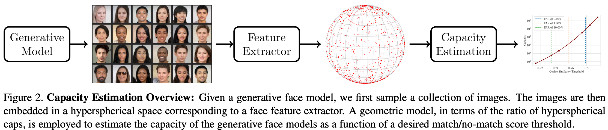
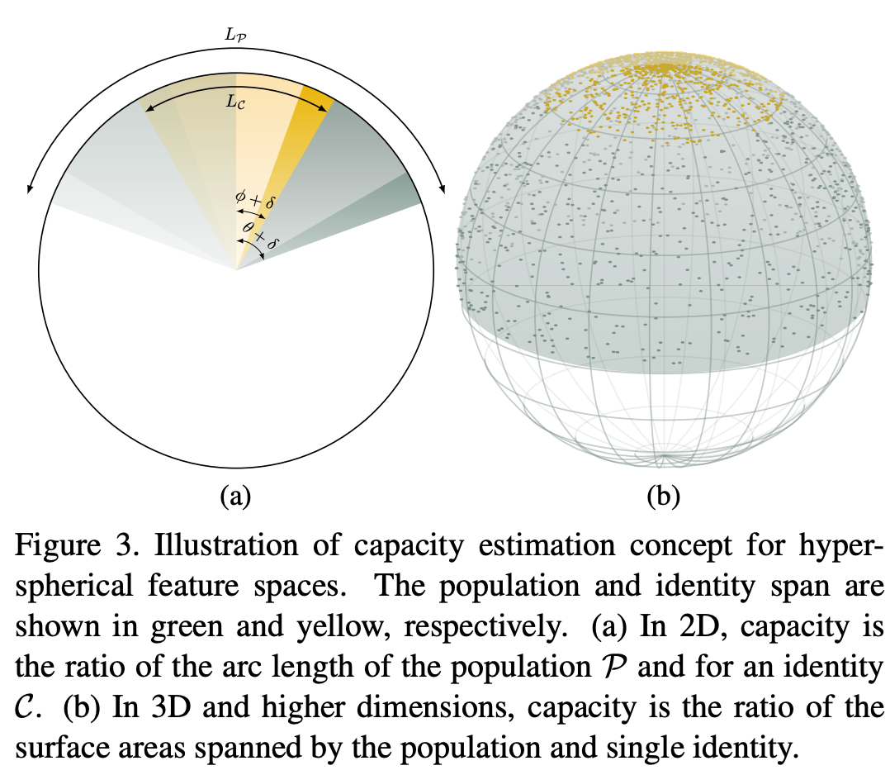

# On the Biometric Capacity of Generative Face Models [[arXiv]](https://arxiv.org/abs/arXiv:2308.02065)

```BibTex
@inproceedings{boddeti2023biometric,
  title={On the Biometric Capacity of Generative Face Models},
  author={Boddeti, Vishnu Naresh and Sreekumar, Gautam and Ross, Arun},
  booktitle={International Joint Conference on Biometrics (IJCB)},
  year={2023}
}
```

## Overview

This work presents the **first** approach for estimating the *biometric capacity* of a given generative face model. Capacity is the *maximal number of unique identities that a given generative face model can generate.* 



### Capacity Estimation Concept

The idea is to represent the generated face images in a hyperspherical space, i.e., $\|z\|=1$, and estimate capacity as a ratio of hyper-spherical caps corresponding to all classes (inter-class variance) and a single class (intra-class variance).

We estimate capacity as a ratio of hyper-spherical caps corresponding to all classes (inter-class variance) and a single class (intra-class variance).



For the general case of a $n$-dimensional representation space, the ratio of hyper-spherical caps with solid angles $\Omega_1$ and $\Omega_2$ is,

$$C(\Omega_1, \Omega_2) = \frac{I_{sin^2(\Omega_1)}\left(\frac{n-1}{2},\frac{1}{2}\right)}{I_{sin^2(\Omega_2)}\left(\frac{n-1}{2},\frac{1}{2}\right)}$$

The key challenge here is accurately estimating the inter-class ($\Omega_1$) and intra-class ($\Omega_2$) angles.

## Assumptions

Before we proceed, we list the assumptions made by our proposed solution to estimate capacity.

- We estimate capacity within a feature space such as ArcFace and AdaFace. The capacity estimate is for a combination of a generative model and a feature extractor. However, this is a well-justified choice. First, raw image pixels entangle identity and geometric and photometric variations. Moreover, since we aim to estimate capacity w.r.t. unique identities instead of unique images, we need to calculate capacity in a representation space that preserves identity while being invariant to other factors. Thus, a face recognition system’s feature space is a well-justified representation choice.

- We estimate the inter-class and intra-class solid angle support from the furthest distance between all the respective samples. So, we inherently assume that the generated samples span the whole representation space within the estimated support. In practice, there may be regions of low feature density, which our approach ignores. Nonetheless, our capacity estimates are upper bounds of the actual capacity and thus still valuable to practitioners and researchers alike.

- We use a single estimate of the intra-class variance to compute capacity. However, classes typically differ in their intra-class variance due to inherent class properties or the number of samples per class.

## How to use

```bash
git clone https://github.com/human-analysis/capacity-generative-face-models
cd capacity-generative-face-models
```

### 1. Download the pre-extracted features from multiple generative face models.

​	Create a folder named features and download the features.

```bash
mkdir features
```

- For ArcFace
  ```bash
  # PGAN
  
  mkdir features/arcface
  
  wget -O features/arcface/pggan_celebahq_1024.pkl https://www.dropbox.com/scl/fi/ttl9v8iptoyg3tppj3y3o/pggan_celebahq_1024.pkl?rlkey=o9wj52idiyt4p08ienpok8ypc&dl=1
  
  # StyleGAN2-Ensemble
  wget -O features/arcface/stylegan2-ensem.pkl https://www.dropbox.com/scl/fi/zp6z35p7i92wp5dbaak9s/stylegan2-ensem.pkl?rlkey=meuuckgl9ilkjimagoml3tf3r&dl=1
  
  # StyleGAN3
  wget -O features/arcface/stylegan3.pkl https://www.dropbox.com/scl/fi/vfiay0im6lfnrep8pb532/stylegan3.pkl?rlkey=z8pf1ho79aojxzcs1ffbeb0nw&dl=1
  
  # Latent Diffusion
  wget -O features/arcface/ldm_celebahq_256.pkl https://www.dropbox.com/scl/fi/krv2v2mpnym0pe433rpzo/ldm_celebahq_256.pkl?rlkey=ij92oz1mhu6d59t39vuexo7vx&dl=1
  
  # Generated.Photos
  wget -O features/arcface/generated.photos.pkl https://www.dropbox.com/scl/fi/sak5o1g2xjxc6ddxyeq3z/generated.photos.pkl?rlkey=k6sk98f1k82l74bf06zlec5jq&dl=1
  
  # DCFace
  wget -O features/arcface/dcface_0.5m.pkl https://www.dropbox.com/scl/fi/eikurrmzz99ddkrpazftv/dcface_0.5m.pkl?rlkey=uul80b0t89opju3lfk5kep83h&dl=1
  ```
  
- For AdaFace
  ```bash
  # PGGAN
  
  mkdir features/adaface
  
  wget -O features/adaface/pggan_celebahq_1024.pkl https://www.dropbox.com/scl/fi/k9hxncbz28aw0hfe7rsuh/pggan_celebahq_1024.pkl?rlkey=zhd23xjf8ckrqabgtbc29wo8c&dl=1
  
  # StyleGAN2-Ensemble
  wget -O features/adaface/stylegan2-ensem.pkl https://www.dropbox.com/scl/fi/f0svvzutn29nsqpegpa8k/stylegan2-ensem.pkl?rlkey=nx49m8sd7qk41jjtx1e34eevp&dl=1
  
  # StyleGAN3
  wget -O features/adaface/stylegan3.pkl https://www.dropbox.com/scl/fi/r63wg2j9kont0gehazw2w/stylegan3.pkl?rlkey=okpsw4ovkc6s4hupi159kt7l1&dl=1
  
  # Latent Diffusion
  wget -O features/adaface/ldm_celebahq_256.pkl https://www.dropbox.com/scl/fi/5mejwwrtws3k2tekb8hz2/ldm_celebahq_256.pkl?rlkey=bcqbxfqrikajc0e9rhdo015mt&dl=1
  
  # Generated.Photos
  wget -O features/adaface/generated.photos.pkl https://www.dropbox.com/scl/fi/no50v5me8ohon7bsbg2e5/generated.photos.pkl?rlkey=rqnkkju3qhvb6gpre77tikp4n&dl=1
  
  # DCFace
  wget -O features/adaface/dcface_0.5m.pkl https://www.dropbox.com/scl/fi/0qinynwk1lp73osza94cf/dcface_0.5m.pkl?rlkey=7rmcpv77f79yqwotnqwwph950&dl=1
  ```
  
  

### 2. Run the demo notebook

Download the ARCFace features from the links above for StyleGAN3 and DCFace. The demo notebook ```demo.ipynb``` walks you through the capacity estimation process for an unconditional (StyleGAN3) and a class-conditional (DCFace) generator.

### 3. Run all capacity estimation experiments

To replicate all results from the paper,

1. Download all the extracted features from the links above.
2. Modify paths, generative model names, feature extractor names etc. in ```constants.py``` if necessary.
3. run ```python3 main.py```

## Requirements

A `requirements.txt` file has been provided.
